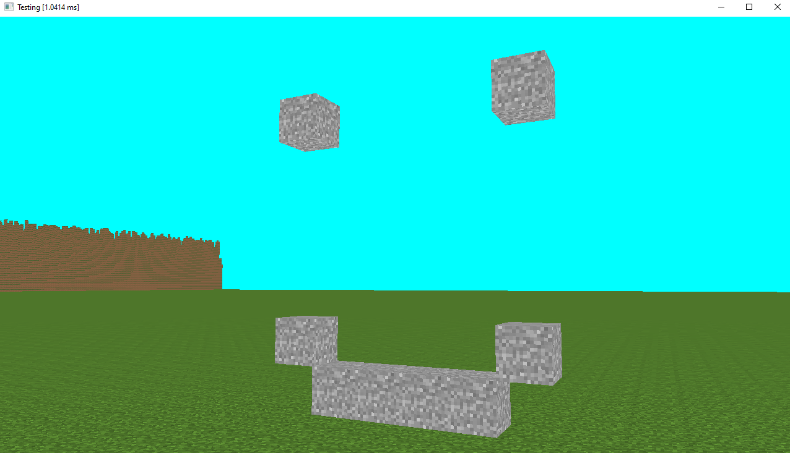

# A Minecraft clone made in C with OpenGL

I'm making this so I can learn OpenGL, multithreading, graphics programming in general and I to also get to know how infinite generation is made.
As a bonus I get to recreate minecraft. 

Its not much yet 

## Features (so far)

 -  Infinite world generation
 -  Multithreading via pthreads 
 -  Decent performance I guess
 -  Block placing and destroying

## Wanna compile it?
   Download glfw3 and the source code and compile.

   Link with the following libraries
   ### On Windows
   > -lgdi32 -lopengl32 -lglfw3 
   ### On Linux
   > -lglfw -lGLU -lGL -lpthread -lXrandr -lm -lXxf86vm -lXi -lXinerama -lX11 -lrt -ldl 

## Todo
   - [ ] Transparency
   - [ ] Lighting and fancy shading
   - [ ] Collisions and fps movement 

## Libraries used

 - [FastNoiseLite](https://github.com/Auburn/FastNoiseLite/blob/master/README.md) GOTAED library
 - [cutility](https://github.com/AlexGoodlife/C-utility) my library :)
