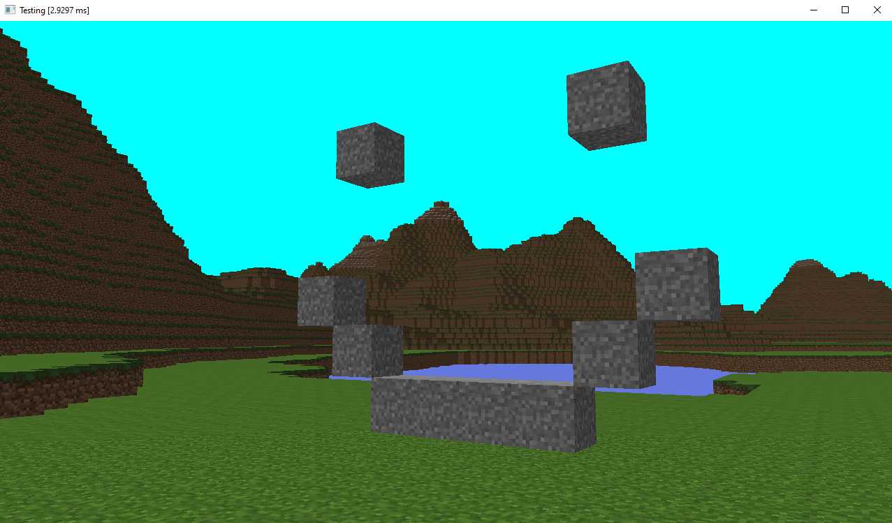

# A Minecraft clone made in C with OpenGL

I'm making this so I can learn OpenGL, multithreading, graphics programming in general and I to also get to know how infinite generation is made.
As a bonus I get to recreate minecraft. 



Its not much yet 

## Features (so far)

 -  Infinite world generation
 -  Multithreading via pthreads 
 -  Decent performance
 -  Block placing and destroying

## Building
You need CMake to build this project and you can run the following commands

```
git clone https://github.com/AlexGoodlife/bv-craft.git
cd bv-craft
mkdir build
cd build
cmake ..
make
```
On windows you don't have mkdir but you can use the equivalent

## Todo
   - [ ] Transparency
   - [ ] Lighting and realistic shading
   - [ ] Collisions and fps movement
   - [ ] Non block entities 

## Libraries used

 - [GLFW3](https://www.glfw.org/)
 - [GLAD](https://glad.dav1d.de/)
 - [stb_image](https://github.com/nothings/stb) Great library
 - [FastNoiseLite](https://github.com/Auburn/FastNoiseLite/blob/master/README.md) Another Great library
 - [cutility](https://github.com/AlexGoodlife/C-utility) my library :)
